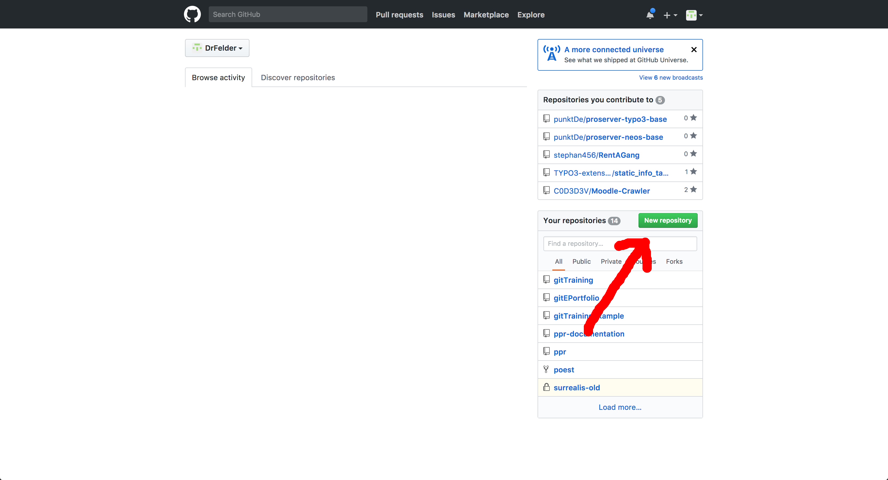
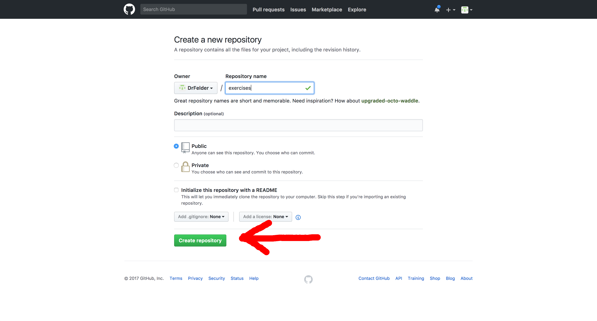
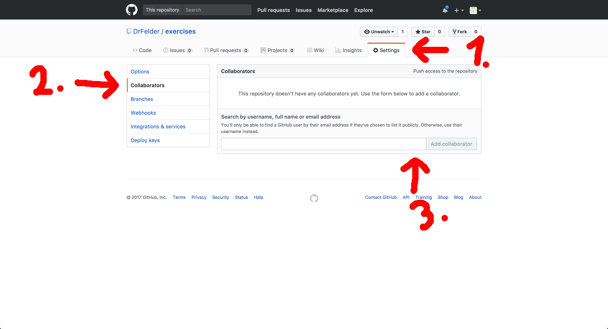
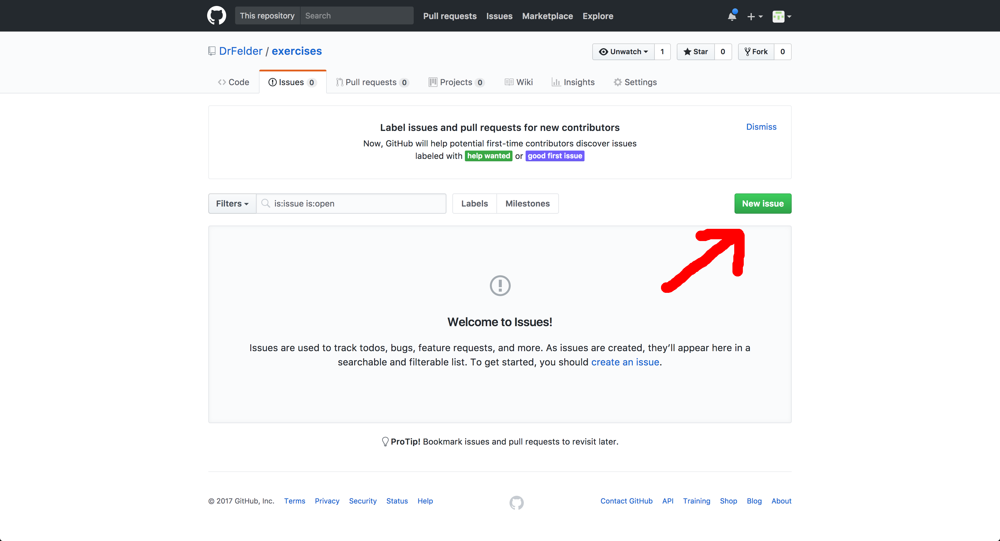
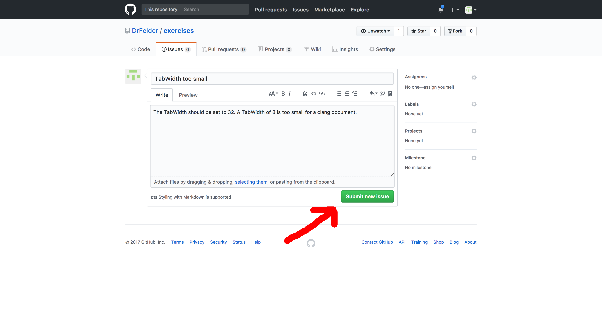
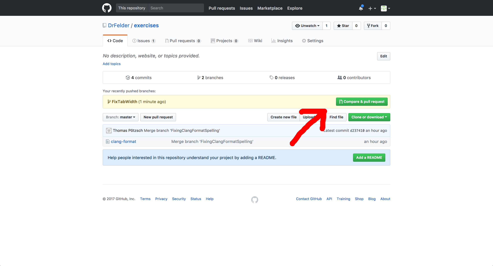
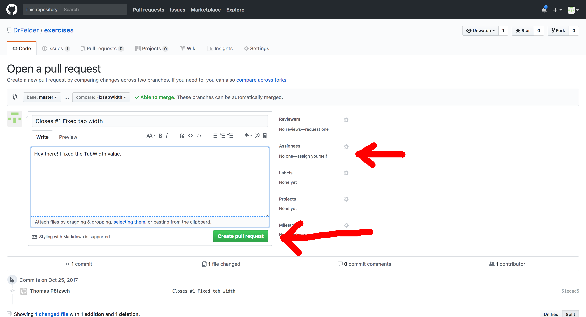
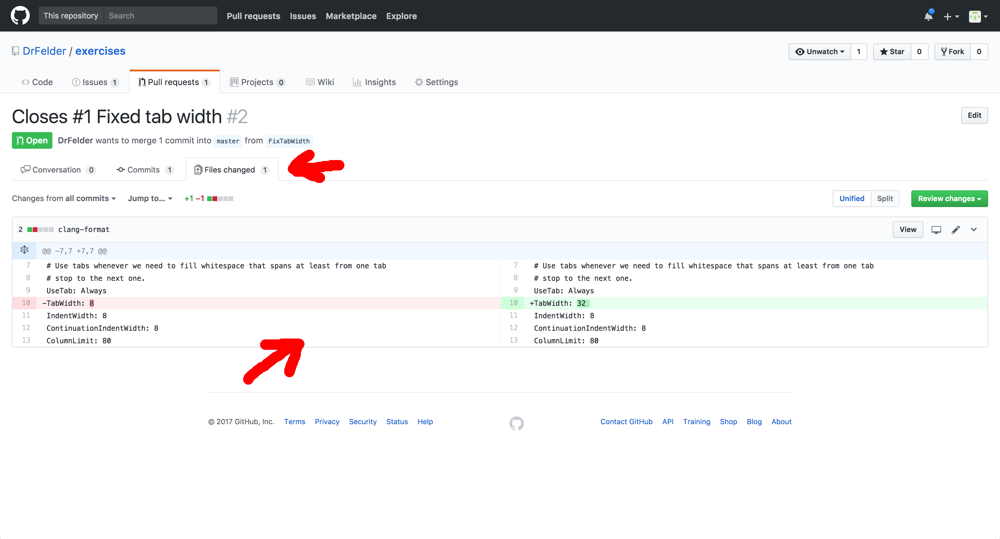
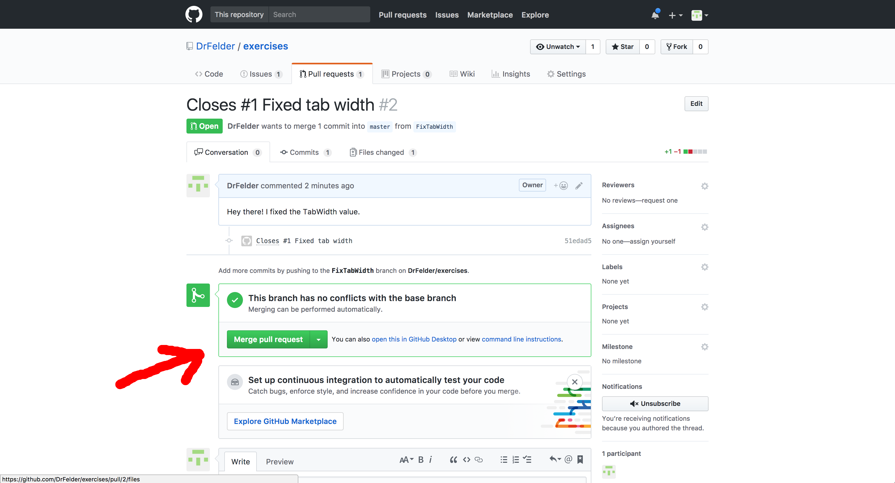

# Git and GitHub - exercises
## 1 Git
These exercises should take you -- minutes to finish.
### 1.1 Committing
Let's start with the basics!
#### 1.1.1
- Create a repository using GitHub.



- Clone the repository.
```
$ git clone https://github.com/<User>/exercises
```
#### 1.1.2
- Add a file to the repository. Call the file `clang-format`.
```
$ touch clang-format
```
- Fill the files with these lines:
```
# This file is an example configuration for clang-format 5.0.
#
# Note that this style definition should only be understood as a hint
# for writing new code. The rules are still work-in-progress and does
# not yet exactly match the the style we have in the existing codee.

# Use tabs whenever we need to fill whitespace that spans at least from one tab
# stop to the next one.
UseTab: Always
TabWidth: 8
IndentWidth: 8
ContinuationIndentWidth: 8
ColumnLimit: 80
```
```
$ vim clang-format
```
#### 1.1.3
- Stage the file and commit it. You can add the following commit message:
```
added clang-format
```
```
$ git add clang-format
$ git commit -m "added clang-format"
[master (root-commit) f318384] added clang-format
 1 file changed, 13 insertions(+)
 create mode 100644 clang-format
```
#### 1.1.4
There seems to be a mistake in the file.
- Fix the duplicate "the" in line 5
```
$ vim clang-format
```
- Stage and commit the files
```
$ git add clang-format
$ git commit -m "removed douplicate word"
[master 5747d71] removed douplicate word
 1 file changed, 1 insertion(+), 1 deletion(-)
```

### 1.2 Branches
You will now get into branching.
- Go ahead and check out the first commit you made to the repository.

    **HINT**: You can check out a commit by using it's commit hash instead of a branch name.
    
```
$ git checkout f318384
```
It seems like the original file contained another mistake at line 5.
- You want to fix a mistake inside the file, so think of a good branch name, create a new branch and check it out.
```
$ git checkout -b "FixingClangFormatSpelling"
Switched to a new branch 'FixingClangFormatSpelling'
```
#### 1.2.1 
- Change the "codee" at line 5 to "code"
```
$ vim clang-format
```
- Stage and commit your changes
```
$ git add clang-format
$ git commit -m "fixed spelling mistake in clang format"
[FixingClangFormatSpelling 43ff41f] fixed spelling mistake in clang format
 1 file changed, 1 insertion(+), 1 deletion(-)
```

Take a look at the history, you will already see some commits!
#### 1.2.2
You've just fixed a major mistake in the file.
The correction should be part of the master branch, don't you think?
- Check out the master branch
```
$ git checkout master
Switched to branch 'master'
Your branch is based on 'origin/master', but the upstream is gone.
  (use "git branch --unset-upstream" to fixup)
```
- Merge the branch you created into the master
```
$ git merge FixingClangFormatSpelling
Auto-merging clang-format
CONFLICT (content): Merge conflict in clang-format
Automatic merge failed; fix conflicts and then commit the result.
```
- Explain what is happening using your own words. If you are having trouble, try to draw a history containing both branches and all the commits.
```
The same line of the same file has been changed in both branches. Git is having difficulties merging them together. This is what it looks like:

# This file is an example configuration for clang-format 5.0.
#
# Note that this style definition should only be understood as a hint
# for writing new code. The rules are still work-in-progress and does
<<<<<<< HEAD
# not yet exactly match the style we have in the existing codee.
=======
# not yet exactly match the the style we have in the existing code.
>>>>>>> FixingClangFormatSpelling

# Use tabs whenever we need to fill whitespace that spans at least from one tab
# stop to the next one.
UseTab: Always
TabWidth: 8
IndentWidth: 8
ContinuationIndentWidth: 8
ColumnLimit: 80
```
#### 1.2.4
Time to clean this mess up!
- Fix the merge conflict you created
```
$ vim clang-format
$ git add clang-format
```
- Finish the merge
```
$ git commit
[master d237410] Merge branch 'FixingClangFormatSpelling'
```
### 1.3 Pushing
- Push your repository to the remote. Take a look at it at GitHub to see if it worked.
```
$ git push
Counting objects: 12, done.
Delta compression using up to 8 threads.
Compressing objects: 100% (8/8), done.
Writing objects: 100% (12/12), 1.21 KiB | 1.21 MiB/s, done.
Total 12 (delta 4), reused 0 (delta 0)
remote: Resolving deltas: 100% (4/4), done.
To https://github.com/DrFelder/exercises
 * [new branch]      master -> master
```
Take a look at the history, a lot has changed over there...
## 2 GitHub
Now that you are a Git expert, you want to spread the word by improving other people's projects. 
### 2.1
- Find a partner to do the following exercises with:
- Add your partner as a collaborator (Settings -> Collaborators -> add him as collaborator) to the repository you created earlier.

- Clone the repository your partner created. It should look quite familiar.
```
$ git clone https://github.com/<User>/exercises
```
### 2.2
It seems like your partner is trying to be silly. He set the TabWidth to 8 in the `clang-format` file!
- Add an issue to your partners repository describing the problem:
```
Title:      TabWidth too small
Comment:    The TabWidth should be set to 32. A TabWidth of 8 is too small for a clang document.
```


While your partner is working on something else, you will just fix his mistake yourself.
- Create and checkout a branch, give it a meaningful name.
```
$ git checkout -b "FixTabWidth"
Switched to a new branch 'FixTabWidth'
```
- Edit the file so that the TabWidth is correct.
```
$ vim clang-format
```
- Commit your changes.

    **HINT**: You can close the issue by adding `closes #<issue ID>` to your commit message.
    
```
$ git add clang-format
$ git commit -m "Closes #1 Fixed tab width"
[FixTabWidth 51edad5] Closes #1 Fixed tab width
 1 file changed, 1 insertion(+), 1 deletion(-)
```
- Close the issue.
```
Issue is going to be closed once th branch is merged.
```
### 2.3
- Push your changes to the remote.
```
$ git push
fatal: The current branch FixTabWidth has no upstream branch.
To push the current branch and set the remote as upstream, use

    git push --set-upstream origin FixTabWidth

$ git push --set-upstream origin FixTabWidth
Counting objects: 3, done.
Delta compression using up to 8 threads.
Compressing objects: 100% (2/2), done.
Writing objects: 100% (3/3), 304 bytes | 304.00 KiB/s, done.
Total 3 (delta 1), reused 0 (delta 0)
remote: Resolving deltas: 100% (1/1), completed with 1 local object.
To https://github.com/DrFelder/exercises
 * [new branch]      FixTabWidth -> FixTabWidth
Branch FixTabWidth set up to track remote branch FixTabWidth from origin.
```
- Create a pull request for the branch you just created and assign your partner.



### 2.4
- Wait until your partner is finished with the exercise. You should receive a pull request.
- Review the changes your partner made to your files.

- Accept the merge request your partner proposed to you if you think his changes improved the file.

Make sure that the branch has been merged into the master.
## 3 Best practices
- Describe how you would handle the following situations (describe the branches and commits that you would create):
    - It is monday, and the project owner tells you to do the following:
        - Implement a major feature (~20KLOC)
        - Replace every tab with 34 spaces
        - Refactor two function names
    - You stopped working on a task to fix a bug. You didn't fix the bug, but you don't want to lose your changes, so you are going to push them.
    - After you implemented a simple database connection (200LOC), you are looking at 54 commits in your history. It seems that you also forgot to add a comma to the previous commit message.

```
-   20KLOC is to much for one branch, it could get confusing. Try splitting the feature into smaller tasks, and add a branch for every task you're working on. 
    Put the refactoring part in a seperate branch. Create one commit for renaming the functions and one for changing the whitespaces.
    
-   Create a WIP commit and push the changes if no one is using the branch. Do not push if somebody is using the branch, keep it clean by using another method to back up your data.

-   Use git commit --amend or git rebase -i to fix the previous commit message. Try squahsing some or all commits, 54 commits is too much for a simple database connection. 
```